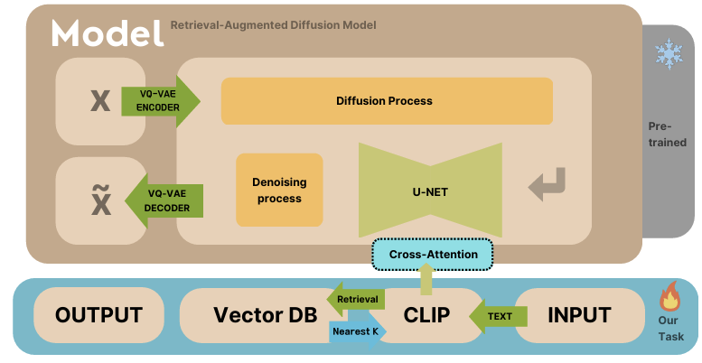
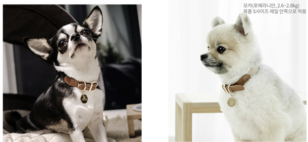
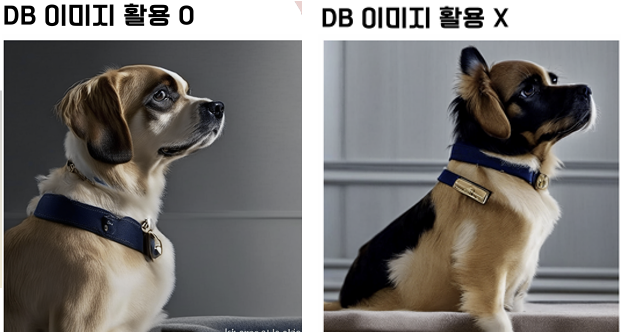
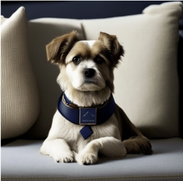
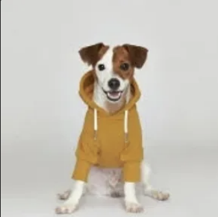
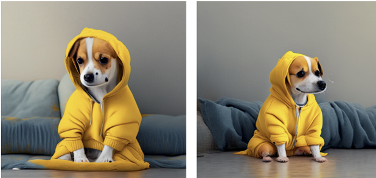
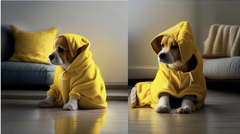

# 🖼️ RDM을 통한 생성 이미지 성능 향상  

## 🌟 **Project Topic**
- **DB 검색 이미지 생성 성능 검증**
    - 단일 입력 텍스트를 세부 서브 쿼리로 분할하여 생성 이미지 디테일 향상
    - 모델의 생성 성능 향상을 위한 DB 구성
    - RAG의 검색 성능 향상을 위한 검색 방법 연구
        - 서브 쿼리를 통한 Retrieve 성능 개선
        - 유사도 검증을 통한 검색 이미지 필터링
- **광고 이미지 생성**
    - 광고주의 의도를 텍스트로 반영한 프로토타입 제작
    - 촬영한 이미지에 대해 다양한 바리에이션 적용
    - 높은 이미지의 품질과 요구 사항 충족도가 필요


## ⚙️ **Process**

### 🧩 `Algorithm`



### 🤖 `Retrieval-Augmented Diffusion Model (RDM)`
Retrieval-Augmented Generation (RAG) 개념을 Latent Diffusion Model (LDM)과 결합한 기법으로, 생성 이미지의 품질을 향상시키기 위해 검색과 생성 과정을 함께 활용하는 모델입니다.

### 🔨 `Changes`
Colab을 활용하여 RDM 컨셉을 구현하기 위해 Prototype 제작을 수행했습니다. 관련 사항은 `Prototype` 폴더에서 확인하실 수 있습니다. RDM 알고리즘의 핵심 요소인 검색 기능을 추가하여, 보다 정교한 데이터 활용이 가능하도록 수정하였습니다.  

사용 생성 모델은 Kandinsky로, 허깅페이스의 KandinskyPriorPipeline을 수정하여, **DB에서 검색한 데이터를 입력으로 받을 수 있도록 구조를 변경**했습니다. 이를 통해 입력 데이터 뿐만 아니라 검색된 데이터를 조건으로 삽입하여 모델의 생성 과정에 반영할 수 있도록 개선했습니다.   
→ 기존의 텍스트, 이미지만 받을 수 있는 모델의 입력 구조를 수정하여 검색 기능 추가 시 성능 개선에 대해 확인하고자 하였습니다.

### 📊 `Data Collection`
**이미지 벡터 DB 데이터 수집 (FAISS)**

- 동물 이미지 500장 (Unsplash)
- 배경 이미지 300장(Unsplash)
- 동물과 사람이 함께 나온 이미지 500장(Unsplash)

### 🧪 `Experiment`

반려동물 용품 광고를 테마로 실험을 진행하였습니다. 
※ DB로 dog_ad.index 파일 사용 

> ### DB 검색 시 생성 성능 (baseline)

▶ 검색 시 full-query를 사용


#### 상세 사항
- **prompt** 
   - This stylish dog collar combines navy fabric with beige leather details. Featuring a gold-tone buckle and a matching tag. The dog wearing the collar, sits on a cushion, gazing at its owner with loving eyes.  

- **image_text** : keybert keyword + input images

- **weight** : similarity score(keyword)+  [0.2, 0.3](input image)

- **input images**


#### **Result**




> ### Subquery DB 검색 시 생성 성능 

▶ 검색 시 LLM 기반 Subquery를 사용


#### 상세 사항
- **prompt** 
   - This stylish dog collar combines navy fabric with beige leather details. Featuring a gold-tone buckle and a matching tag. The dog wearing the collar, sits on a cushion, gazing at its owner with loving eyes.  

- **image_text** : summarized query + input images

- **weight** : query_importance(sub-query) +  [0.2, 0.3](input image)

- **input images**


#### **Result**




> ### input query 복잡도 상승 시 Subquery DB 검색 생성 성능 

▶ 목줄이 아니라 옷으로 Target 변경 + prompt 복잡도 증가
▶ 검색 시 LLM 기반 Subquery를 사용


#### 상세 사항
- **prompt** 
   - A cute dog wearing yellow hoodie sits on a stylish sofa, gazing around in a warm and cozy living room. Soft lighting fills the space, casting gentle shadows on the plush cushions. The atmosphere feels calm and inviting, with a sense of comfort and warmth. 

- **sub-query**
   ```python
   {'subqueries': [{'query': 'A cute dog wearing a yellow hoodie', 'weight': 0.4},
  {'query': 'A stylish sofa', 'weight': 0.2},
  {'query': 'A warm and cozy living room', 'weight': 0.2},
  {'query': 'Soft lighting casting gentle shadows', 'weight': 0.1},
  {'query': 'Plush cushions', 'weight': 0.1}]}
   ```

- **image_text** : summarized query + retrieved images by subquery+ sub-query + input images

- **weight** : similarity score(keyword)+  [0.4](input image)

- **input images**  


#### **Result**



> ### Subquery DB 검색 + 코사인 유사도 필터링 시 생성 성능 

▶ 목줄이 아니라 옷으로 Target 변경 + prompt 복잡도 증가
▶ LLM 기반 Subquery를 사용 + 코사인 유사도를 통한 필터링 수행 → 요구를 잘 반영하는 검색 결과 백터 생성


#### 상세 사항
- **prompt** 
   - A cute dog wearing yellow hoodie sits on a stylish sofa, gazing around in a warm and cozy living room. Soft lighting fills the space, casting gentle shadows on the plush cushions. The atmosphere feels calm and inviting, with a sense of comfort and warmth. 

- **sub-query**
   ```python
   {'subqueries': [{'query': 'A cute dog wearing a yellow hoodie', 'weight': 0.4},
  {'query': 'A stylish sofa', 'weight': 0.3},
  {'query': 'A warm and cozy living room', 'weight': 0.3}]}
   ```

- **image_text** : summarized query +  filtered retrieved image + filtered sub-query + input images

- **weight** : similarity score(keyword)+  [0.4](input image)

- **input images**  


#### **Result**



## 🎯 **Effectiveness of the Project**
- 요구 충족도 : 이용자의 복잡한 의도를 반영한 광고 이미지 생성
- 이미지 품질 개선 : 생성에 필요한 이미지를 DB로 보충하여 품질 개선

## 📂 **Project Information**

### **🧑‍🤝‍🧑 Team Members**

| 기수  | 팀원 |
|------|------|
| **14기** | 김민열, 김홍재, 우동협 |
| **15기** | 이지영, 황서현 |


### **📅 Progress Period**

- 2025.01.11 ~ 2025.02.22

 


### **📌 Repository Structure**  
```bash
📂 BITAmin-LLM
│── 📂 Data/               # DB 파일 모음
│── 📂 Experiment/         # 이미지 생성 성능 향상을 위한 실험 파일 모음
│── 📂 Prototype/          # 검색 프로세스를 반영한 prototype
│── 📂 Readme_images/      # README.md 작성을 위한 image
│── README.md             # 프로젝트 개요 및 진행 내용
